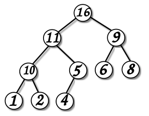

Двоичная куча
=============

*Двоичная куча* (или *пирамида*) --- структура данных, позволяющая находить минимальный элемент массива за время :math:`O(1)` и модифицировать массив за время :math:`O(\log n)`.

Куча основана на использовании двоичного дерева со специальным свойством: значение любого узла должно быть меньше значений обоих его потомков.

   Пример кучи наоборот --- значение узла *больше* значений потомков.

Сохранение кучи в памяти
------------------------

Пронумеруем элементы кучи от 0 до :math:`n-1`. Заметим, что тогда индексы потомков узла :math:`i` можно вычислить как :math:`2i+1` и :math:`2i+2`, а индекс предка как :math:`(i-1)/2`. Значит, можно сохранить кучу в линейный список и переходить по узлам дерева с помощью индексов.

Использование
-------------

Куча поддерживает следующие операции:

- Построение кучи
- Извлечение минимума
- Добавление элемента

Для построения кучи используется вспомогательная функция ``heapify``:, которая опускает ключ ниже в дерево для восстановления свойства кучи.

Реализация
----------

Реализация кучи на языке Python состоит из четырёх функций. Предполагается, что в программе объявлен массив ``H``, в котором сохранена куча.::

    def heapify(v):
        """
        Эта функция восстанавливает свойство кучи для элемента v и его потомков, проталкивая его вниз если нужно.
        """

        m = v
        # Сравним значение в v со значениями в его потомках, если они есть, и найдем минимальное:
        if 2 * v + 1 < len(H) and H[2 * v + 1] < H[v]:
            m = 2 * v + 1

        if 2 * v + 2 < len(H) and H[2 * v + 2] < H[m]:
            m = 2 * v + 2

        # Если m не равно v, то узел m имеет ключ, меньший ключа v, что нарушает кучу.
        # Значит, требуется поменять местами v и m и продолжить восстанавливать кучу из m.
        if m != v:
            H[m], H[v] = H[v], H[m]
            heapify(m)

::

    def build_heap():
        """
        Эта функция превращает произвольный массив H в кучу.
        Для этого вызывается функция heapify для всех узлов, у которых есть потомки
        """

        for v in range(len(H) // 2, -1, -1):
            heapify(v)

::

    def get_min():
        """
        Эта функция удаляет из кучи минимальный элемент и возвращает его.
        """

        m = H[0] # Запоминаем текущий минимум
        H[0] = H.pop() # Переносим последний элемент на первое место.
        heapify(0) # Проталкиваем корень вниз для восстановления кучи
        return m # И возвращаем минимальное значение

::

    def add(k):
        """
        Эта функция добавляет новый элемент в кучу.
        """

        # Сначала элемент добавляется в конец
        H.append(k)
        i = len(H) - 1

        # Затем он поднимается наверх, пока его ключ меньше ключа родителя (это нарушает свойство кучи)
        while i > 0 and H[i] < H[(i - 1) // 2]:
            H[i], H[(i - 1) // 2] = H[(i - 1) // 2], H[i]
            i = (i - 1) // 2

